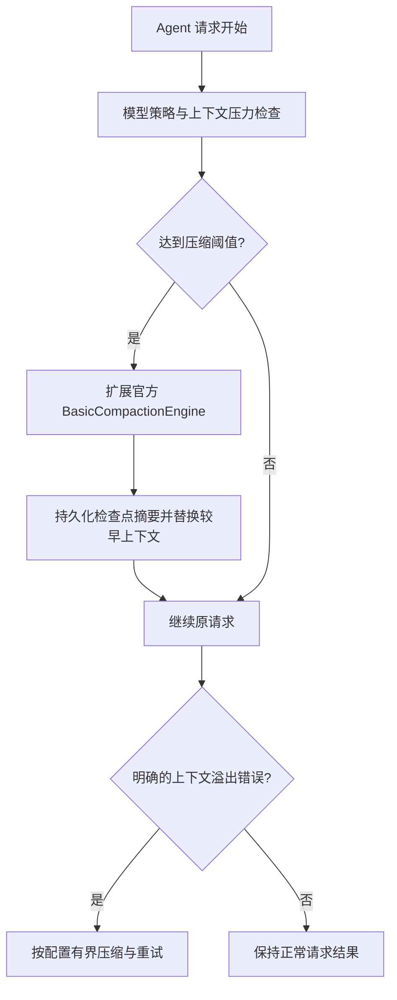

# dsh-compact

`dsh-compact` 是面向 [DeepSeek Harness](https://github.com/deepseek-ai/deepseek-harness) 的上下文压缩插件，用于在对话接近模型上下文上限时自动生成检查点摘要，并在发生上下文溢出时进行有界恢复。

该插件最初随 [Deepseek Harness EAC](https://github.com/DSH-EAC/DSH-Desktop-EAC) 开发，独立仓库用于单独维护和分发插件本体。

## 功能

- 根据上下文占用比例，在普通请求开始前自动压缩历史内容。
- 提供 `/compact` 命令和设置页中的手动压缩入口。
- 保留最近一段上下文，将较早内容替换成持久化摘要。
- 上下文溢出时最多按配置进行有限次数的压缩恢复和请求重试。
- 裁剪过长的工具结果，降低工具输出持续占用上下文的概率。
- 支持按模型配置不同的触发比例、保留比例和恢复策略。
- 压缩失败时不中断用户当前请求。
- 单次压力检查最多生成一个摘要，避免同一回合连续压缩。
- 当摘要模型返回空文本时，会移除 Agent system prompt 和工具定义后降级重试一次。

## 安装

### Deepseek Harness EAC

包含 `dsh-compact` 的 EAC 发行版已提供内置安装。若已通过 EAC 安装该插件，不需要重复添加；具体内置版本及宿主兼容性以对应 EAC 发行版为准。

独立仓库只分发插件本体。桌面宿主集成与 preset 迁移由 EAC 主项目维护，独立版本与 EAC 内置版本可能不同。

### 从 GitHub 安装

完全退出正在运行的 DSH 服务，然后执行：

```sh
dsh plugin --profile web add "github:zixin947/dsh-compact#main"
```

安装完成后重新启动 DSH Web 服务。

默认挂载配置由 `cordis.patch.yml` 提供：

```yaml
- id: compact
  name: 'dsh-compact'
```

如果目标 Agent preset 需要独立的 Agent 级压缩入口，可以在对应组合中挂载：

```yaml
- id: compact-agent
  name: 'dsh-compact/agent'
  isolate:
    compaction: true
    toolResultPruner: true
```

`dsh-compact/agent` 会在同一个 Agent 局部作用域中组合压缩引擎、`/compact` 命令和工具结果裁剪器。

## 默认配置

| 配置项 | 默认值 | 说明 |
| --- | ---: | --- |
| `enabled` | `true` | 是否启用自动压缩和溢出恢复 |
| `thresholdRatio` | `0.75` | 上下文达到模型窗口的 75% 时触发自动压缩 |
| `retainRatio` | `0.20` | 压缩后保留最近约 20% 的上下文 |
| `recoverOnOverflow` | `true` | 上下文溢出时是否尝试压缩恢复 |
| `maxOverflowRetries` | `1` | 原请求发生溢出后允许的最大恢复重试次数 |
| `modelPolicies` | `[]` | 按 provider 和 model 精确覆盖默认策略 |

示例：

```yaml
- id: compact
  name: 'dsh-compact'
  config:
    enabled: true
    thresholdRatio: 0.75
    retainRatio: 0.20
    recoverOnOverflow: true
    maxOverflowRetries: 1
    modelPolicies:
      - provider: youchu
        model: deepseek-v4-flash
        thresholdRatio: 0.80
        retainRatio: 0.20
```

约束：

- `thresholdRatio` 允许范围为 `0.50` 到 `0.95`。
- `retainRatio` 允许范围为 `0.05` 到 `0.50`。
- `retainRatio` 必须小于对应的 `thresholdRatio`。
- 模型策略使用 `provider + model` 精确匹配。

## 架构



- `lib/agent.js`：在同一个 Agent 局部作用域内组合压缩引擎、官方 `/compact` 命令与工具结果裁剪器。
- `lib/engine.js`：扩展官方基础引擎，接入请求前检查、溢出恢复、空摘要降级、取消与状态清理。
- `lib/policy.js`：共享配置、按模型覆盖、会话状态与策略解析。
- `lib/index.js` 与 `lib/client.js`：插件入口、状态接口和设置界面。

插件复用官方摘要与持久化能力；此仓库不实现检索式长期记忆或 RAG Pipeline。

## 工作机制

### 自动压缩

每次 Agent 请求开始前，插件读取当前模型的上下文窗口和会话 Token 估算值。达到触发阈值时：

1. 选择可以压缩的较早会话区间。
2. 使用当前会话的模型生成结构化检查点摘要。
3. 将原区间替换为带来源信息的持久摘要。
4. 继续执行用户原本的请求。

每次压力检查只进行一次压缩。如果压缩后仍高于阈值，当前请求不会立即进行第二轮摘要；后续普通请求仍可再次触发压缩。

### 溢出恢复

当模型明确返回上下文窗口超限错误时，插件可以压缩当前会话并重试原请求。恢复次数受 `maxOverflowRetries` 限制，取消中的请求不会重试，也不会无限循环。

### 空摘要降级

如果首次摘要调用成功返回但没有任何文本，插件会删除用于普通 Agent 工作的 system prompt 和工具定义，再使用相同会话消息重试一次。其他模型或网络错误不会被误判为可重试的空摘要错误。

## 导出入口

| 入口 | 用途 |
| --- | --- |
| `dsh-compact` | 设置、状态接口和默认插件入口 |
| `dsh-compact/agent` | 组合压缩引擎、命令和工具结果裁剪器 |
| `dsh-compact/engine` | 压缩引擎入口 |
| `dsh-compact/client` | Web 设置界面入口 |

一般使用者只需要挂载 `dsh-compact` 或 `dsh-compact/agent`，不建议单独挂载内部实现入口。

## 安全与限制

- 插件只处理 DSH 会话上下文，不会删除工作区文件。
- 压缩会用摘要替换较早的会话显示内容，因此摘要质量取决于当前模型。
- 自动压缩失败时会记录状态并继续用户请求，不会因为摘要服务异常直接中断当前回合。
- 该版本面向 `@deepseek-ai/dsh 0.1.0-rc.7` 及相同插件 API 的版本。
- 独立仓库只包含插件本体；EAC 的 preset 迁移和桌面宿主集成仍由 EAC 主项目维护。

## 版本与验证边界

- 当前 `package.json` 版本为 `1.0.0`，安装命令使用 `main` 分支；仓库尚未提供独立 tag 或 Release。
- 当前声明面向 `@deepseek-ai/dsh 0.1.0-rc.7` 及相同插件 API 的版本。新版宿主需要单独验证，不能仅依据安装成功推断兼容。
- 本仓库尚未配置独立测试脚本或 CI；EAC 主项目维护其宿主集成与相关回归测试。
- 使用说明中的流程与默认值来自当前源码。升级前应核对宿主版本、插件版本及现有挂载配置。

## 反馈问题

发现问题时，请在 [GitHub Issues](https://github.com/zixin947/dsh-compact/issues) 提交，并尽量附上：

- DSH 和插件版本；
- 使用的 provider 与 model；
- 是否为自动压缩、手动压缩或溢出恢复；
- 脱敏后的错误日志和复现步骤。

## 许可证

[MIT License](LICENSE)
